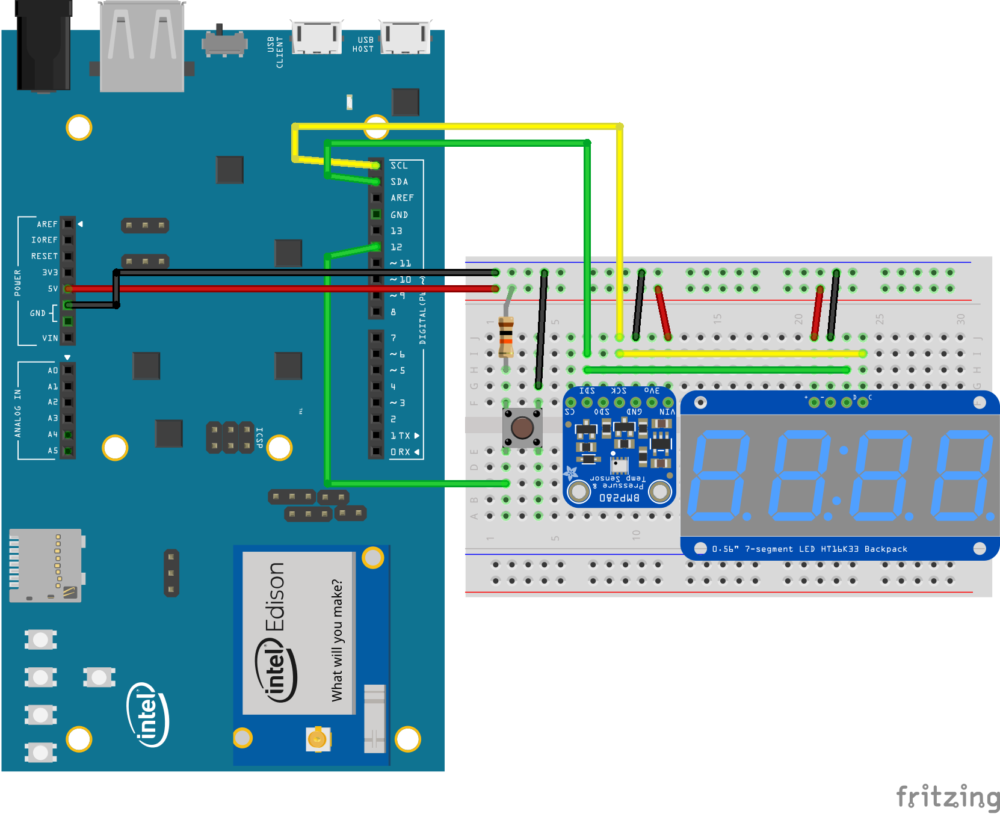
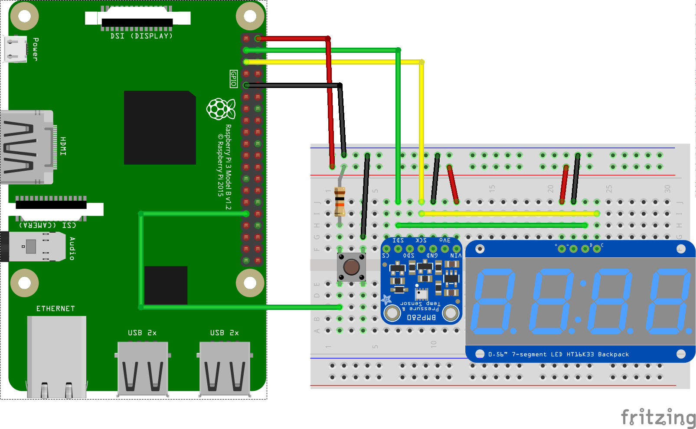

Android Things Weather Station sample
=====================================

This sample shows integration of multiple Android Things peripheral to build a connected Weather Station.

Pre-requisites
--------------
- Android Things compatible board
- Android Studio 2.2+
- [Rainbow Hat for Android Things](https://shop.pimoroni.com/products/rainbow-hat-for-android-things) or the following individual components:
    - 1 [bmp280 temperature sensor](https://www.adafruit.com/product/2651)
    - 1 [segment display with I2C backpack](https://www.adafruit.com/product/1270)
    - 1 push button
    - 1 resistor
    - jumper wires
    - 1 breadboard
    - (optional) 1 [APA102 compatible RGB Led strip](https://www.adafruit.com/product/2241)
    - (optional) 1 [Piezo Buzzer](https://www.adafruit.com/products/160)
    - (optional) [Google Cloud Platform](https://cloud.google.com/) project

Schematics
----------

If you have the Raspberry Pi [Rainbow Hat for Android Things](https://shop.pimoroni.com/products/rainbow-hat-for-android-things), just plug it onto your Raspberry Pi 3.




Build and install
=================
On Android Studio, click on the "Run" button.
If you prefer to run on the command line, type
```bash
./gradlew installDebug
adb shell am start com.example.androidthings.weatherstation/.WeatherStationActivity
```

If you have everything set up correctly:
- The segment display will show the current temperature.
- If the button is pressed, the display will show the current pressure.
- If a Piezo Buzzer is connected, it will plays a funny sound on startup.
- If a APA102 RGB Led strip is connected, it will display a rainbow of 7 pixels indicating the current pressure.
- If a Google Cloud Platform project is configured (see instruction below), it will publish the sensor data to Google Cloug PubSub.

Google Cloud Platform configuration (optional)
==============================================
0. Go to your project in the [Google Cloud Platform console](https://console.cloud.google.com/)
0. Under *API Manager*, enable the following APIs: Cloud Pub/Sub
0. Under *IAM & Admin*, create a new Service Account, provision a new private key and save the generated json credentials.
0. Under *Pub/Sub*: create a new topic and in the *Permissions* add the service account created in the previous step with the role *Pub/Sub Publisher*.
0. Under *Pub/Sub*: create a new *Pull subscription* on your new topic.
0. Import the project into Android Studio. Add a file named `credentials.json` inside `app/src/main/res/raw/` with the contents of the credentials you downloaded in the previous steps.
0. In `app/build.gradle`, replace the `buildConfigField` values with values from your project setup.

After running the sample, you can check that your data is ingested in Google Cloud Pub/Sub by running the following command:
```
gcloud --project <CLOUD_PROJECT_ID> beta pubsub subscriptions pull <PULL_SUBSCRIBTION_NAME>
```

Note: If there is no `credentials.json` file in `app/src/main/res/raw`, the app will
 run offline and will not send sensor data to the [Google Cloud Pub/Sub](https://cloud.google.com/pubsub/).

Next steps
==========

Now your weather sensor data is continuously being published to [Google Cloud Pub/Sub](https://cloud.google.com/pubsub/):
- process weather data with [Google Cloud Dataflow](https://cloud.google.com/dataflow/) or [Google Cloud Functions](https://cloud.google.com/functions/)
- persist weather data in [Google Cloud Bigtable](https://cloud.google.com/bigtable/) or [BigQuery](https://cloud.google.com/bigquery/)
- create some weather visualization with [Google Cloud Datalab](https://cloud.google.com/datalab/)
- build weather prediction model with [Google Cloud Machine Learning](https://cloud.google.com/ml/)

License
-------
Copyright 2016 The Android Open Source Project, Inc.
Licensed to the Apache Software Foundation (ASF) under one or more contributor
license agreements.  See the NOTICE file distributed with this work for
additional information regarding copyright ownership.  The ASF licenses this
file to you under the Apache License, Version 2.0 (the "License"); you may not
use this file except in compliance with the License.  You may obtain a copy of
the License at
  http://www.apache.org/licenses/LICENSE-2.0
Unless required by applicable law or agreed to in writing, software
distributed under the License is distributed on an "AS IS" BASIS, WITHOUT
WARRANTIES OR CONDITIONS OF ANY KIND, either express or implied.  See the
License for the specific language governing permissions and limitations under
the License.
